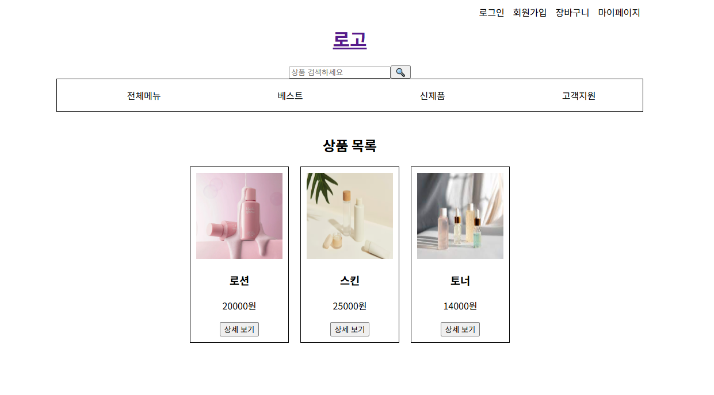
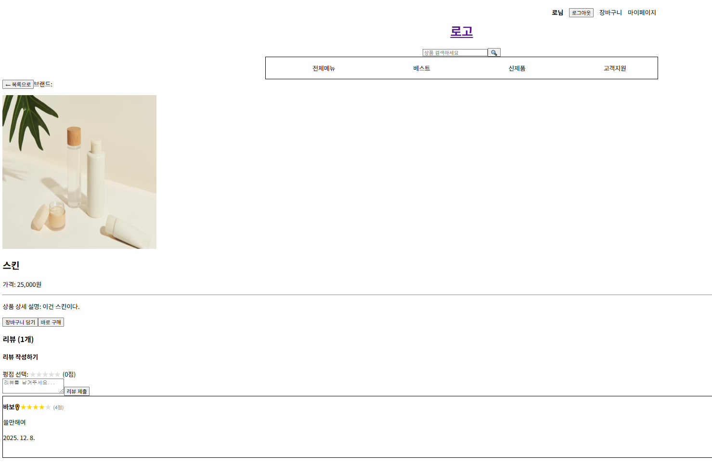

2025.12.02

<h1>프로젝트 생성</h1>

2025.12.03

<h1>프로젝트 실행방법</h1>

프론트

cd front -> (npm install) -> npm run dev

백

cd back

npm install -> (express cors mariadb)

(npm install nodemon)

npm install dotenv

package.json 에 11번째 줄
"dev": "nodemon cart.js" 에서 변경 실행 가능

npm run dev

처음 실행화면

로그인한뒤 상품 상세 페이지

