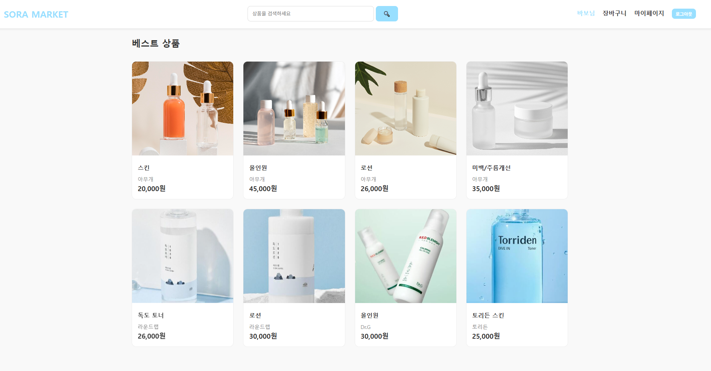
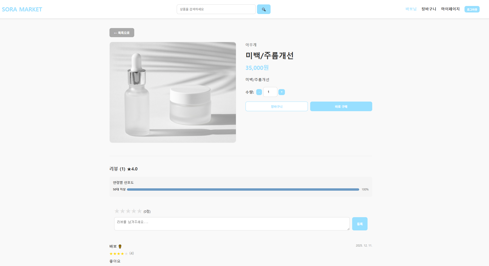
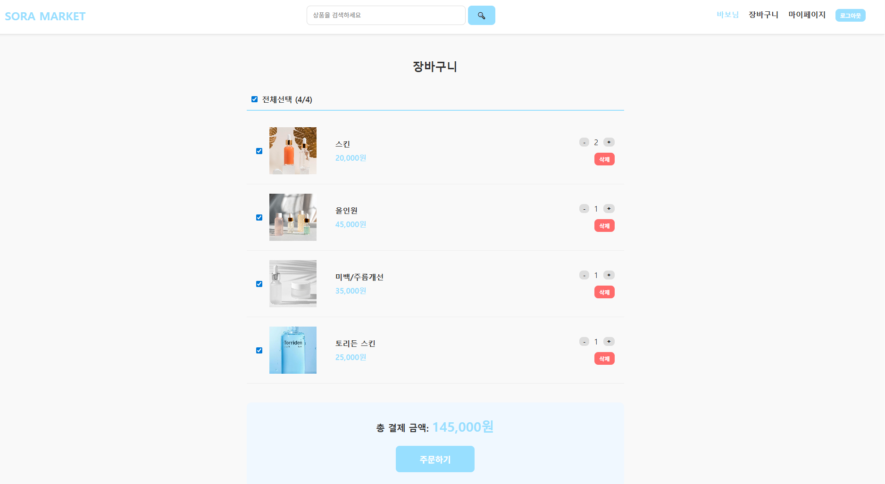
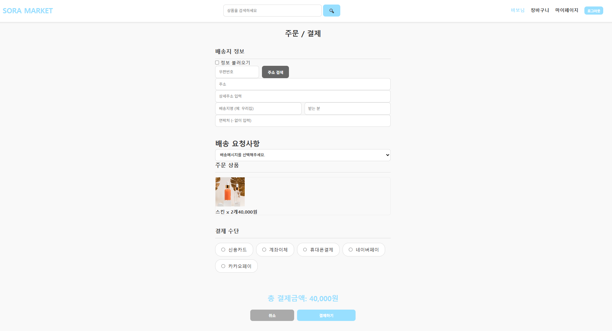
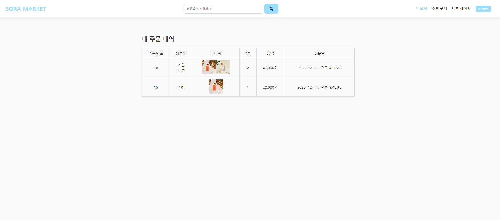
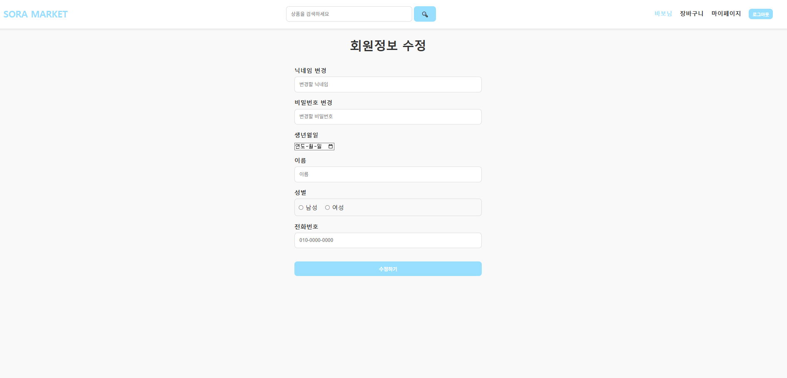
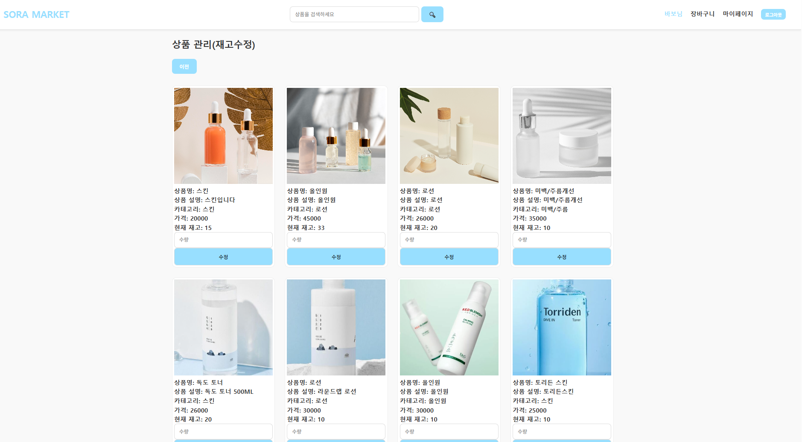
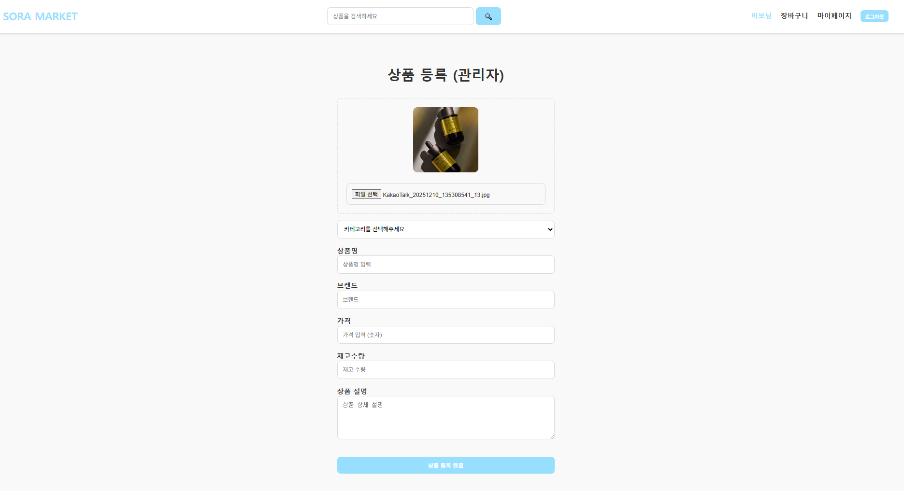
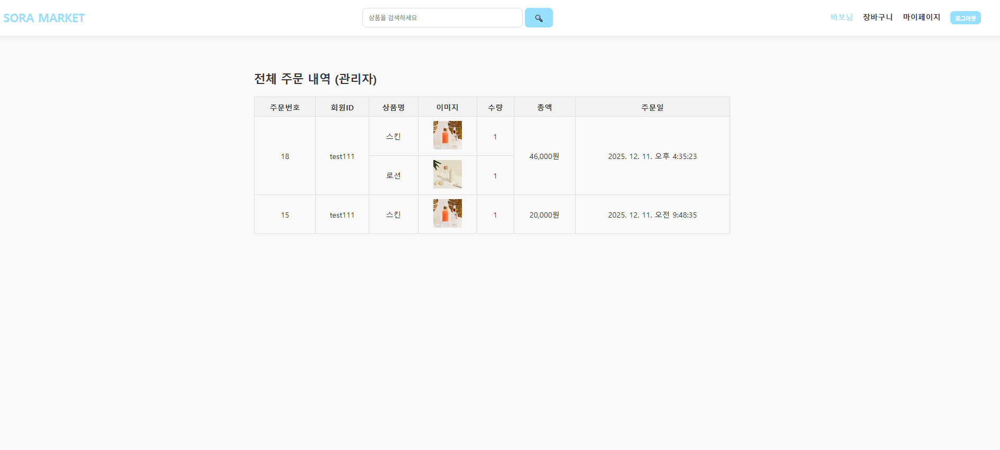

2025.12.02

<h1>프로젝트 생성</h1>

2025.12.03

<h1>프로젝트 실행방법</h1>

프론트

npm install => npm run dev

백

cd back

package.json 에 11번째 줄
"dev": "nodemon cart.js" 에서 변경 실행 가능

npm install => npm run dev

처음 실행화면

제품 상세 페이지

장바구니 페이지

주문/결제 페이지

주문 내역 페이지

회원 정보 수정 페이지

재고 수정 페이지(관리자 전용)

상품 등록 페이지(관리자 전용)

주문 내역 페이지(관리자 전용)
